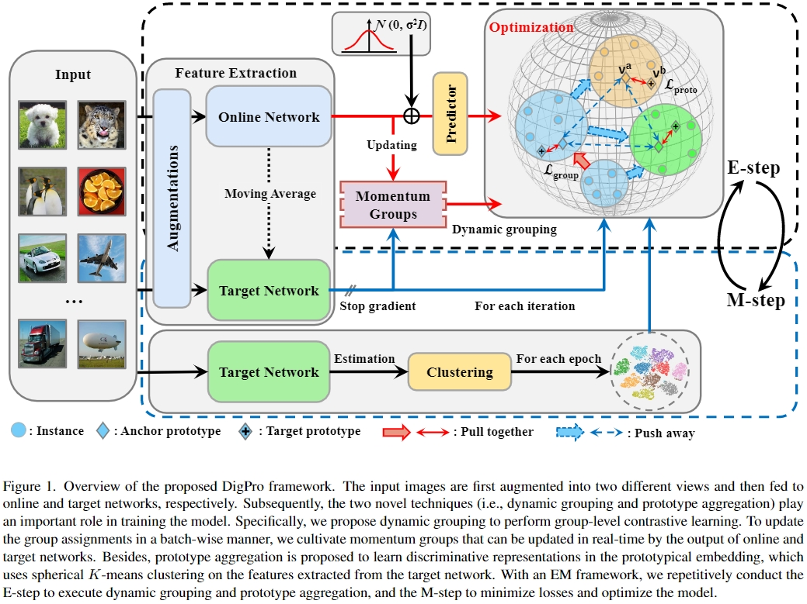
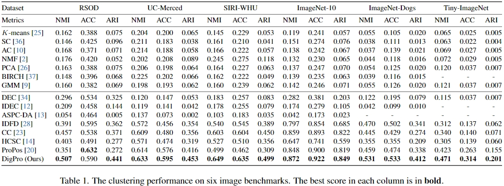

## Towards Efficient and Effective Deep Clustering with Dynamic Grouping and Prototype Aggregation

The official implementation of our [DigPro](https://arxiv.org/abs/2401.13581).

> Towards Efficient and Effective Deep Clustering with Dynamic Grouping and Prototype Aggregation <br>
> https://arxiv.org/abs/2401.13581 <br>
> 
> Abstract: Previous contrastive deep clustering methods mostly focus on instance-level information while overlooking the member relationship within groups/clusters, which may significantly undermine their representation learning and clustering capability. Recently, some group-contrastive methods have been developed, which, however, typically rely on the samples of the entire dataset to obtain pseudo labels and lack the ability to efficiently update the group assignments in a batch-wise manner. To tackle these critical issues, we present a novel end-to-end deep clustering framework with dynamic grouping and prototype aggregation, termed as DigPro. Specifically, the proposed dynamic grouping extends contrastive learning from instance-level to group-level, which is effective and efficient for timely updating groups. Meanwhile, we perform contrastive learning on prototypes in a spherical feature space, termed as prototype aggregation, which aims to maximize the inter-cluster distance. Notably, with an expectation-maximization framework, DigPro simultaneously takes advantage of compact intra-cluster connections, well-separated clusters, and efficient group updating during the self-supervised training. Extensive experiments on six image benchmarks demonstrate the superior performance of our approach over the state-of-the-art.

**If you found this code helps your work, do not hesitate to cite my paper or star this repo!**

### Introduction

The detail implementations and the results can be found in `models/`, and in the following Table 1, respectively.

##### Overall Framework



##### Main Results



Note that: For we have reproduced the  results  of  IDFD,  CC , HCSD and  ProPos  by  using  their  official code and strictly following the suggested settings.  For a fair comparison, we train all clustering approaches for 1,000 epochs. All  experiments  are  run  on  an NVIDIA GeForce RTX 3090 GPU.

### Training

#### Install requirements

Following ProPos, the kmeans and GMM clustering using pure PyTorch and the relative code can be found at https://github.com/Hzzone/torch_clustering.

Install requirements:

```shell
pip install -r requirements.txt
```

#### Training Commands
The config files are in `config/`, just run the following command:
```shell
export CUDA_VISIBLE_DEVICES=0 # use the first GPU
torchrun --master_port 17673 --nproc_per_node=1 main.py config/ImageNet-10_r18_propos.yml
```
or
```shell
export CUDA_VISIBLE_DEVICES=0 # use the first GPU
python -m torch.distributed.launch --nproc_per_node=1 --master_port=17672 main.py config/ImageNet-10_r18_propos.yml
```

##### Aftering training, you can see the results including the logs of loss and metrics, and saved model.pth in`ckpt/`.

We can also enable the WANDB (default not wandb) to visualize the training!

Set the `wandb` parameters to true, and login to wandb.ai:
```shell
wandb login xxx
```

#### Visualize the learned representations

see `feature_visualization.py(recommended) or notebook/feature_visualization.ipynb` [](https://colab.research.google.com/github/Hzzone/ProPos/blob/master/notebook/feature_visualization.ipynb)

### Citation

If you found this code or our work useful please cite us:

```bibtex
@misc{zhang2024efficient,
      title={Towards Efficient and Effective Deep Clustering with Dynamic Grouping and Prototype Aggregation}, 
      author={Haixin Zhang and Dong Huang},
      year={2024},
      eprint={2401.13581},
      archivePrefix={arXiv},
      primaryClass={cs.CV}
}
```

Special thanks to the following paper works:

```bibtex
@article{huang2022learning,
  title={Learning representation for clustering via prototype scattering and positive sampling},
  author={Huang, Zhizhong and Chen, Jie and Zhang, Junping and Shan, Hongming},
  journal={IEEE Transactions on Pattern Analysis and Machine Intelligence},
  year={2022},
  publisher={IEEE}
}
```


```bibtex
@inproceedings{pang2022unsupervised,
  title={Unsupervised visual representation learning by synchronous momentum grouping},
  author={Pang, Bo and Zhang, Yifan and Li, Yaoyi and Cai, Jia and Lu, Cewu},
  booktitle={European Conference on Computer Vision},
  pages={265--282},
  year={2022},
  organization={Springer}
}
```

